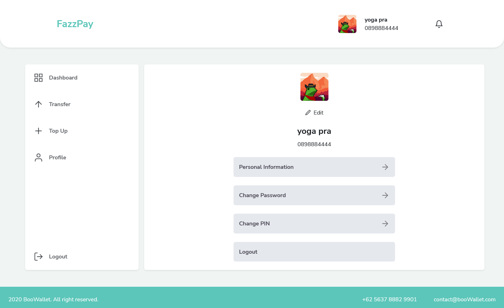

# Next JS - fazzpay
<!-- 

  
   
  

   
  
   

 -->

## About
Web application for transfer money or payment
this web application made using Next js as a framework and Bootstrap as styling
## Built With
- [Next js](https://nextjs.org/)
- [Bootstrap](hhttps://getbootstrap.com/)

## Requirements
1. [Node js](https://nodejs.org)
2. Node_modules, type in terminal `npm install or yarn install`

## How to run app?
1. Clone this project to your local computer
2. Open this project in your code editor and type `npm install or yarn install` in terminal
3. Edit .env file at next.config.js `env:{ BACK_END_URL: your backend api}` if you have own backend
4. type `yarn dev` or `npm run dev` on terminal

## Acknowledgements
- [Axios](https://axios-http.com/)
- [Redux](https://redux.js.org/)
- [React Redux](https://react-redux.js.org/)